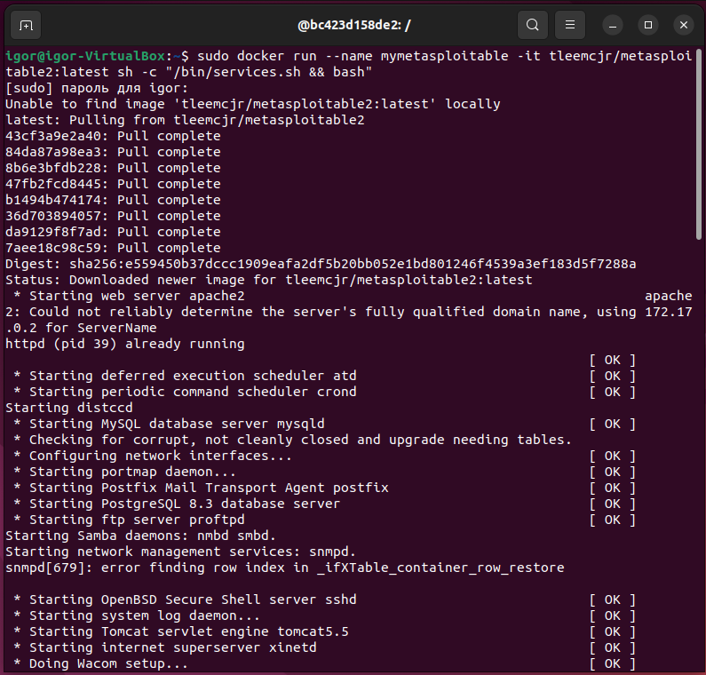
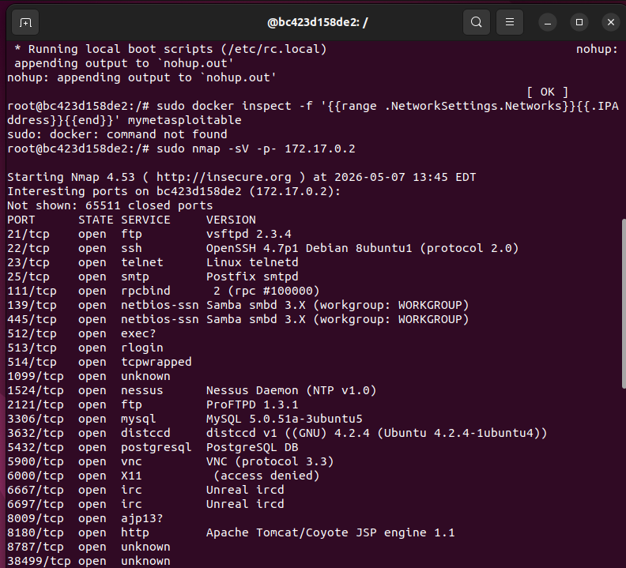
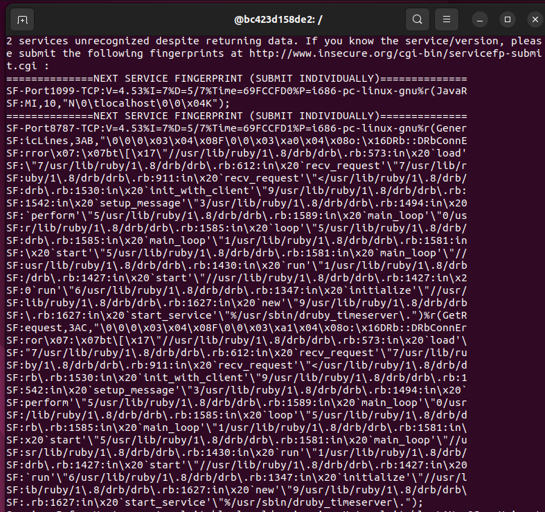
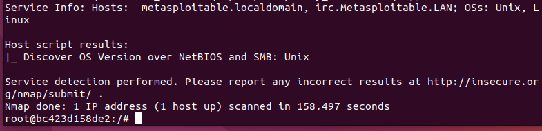
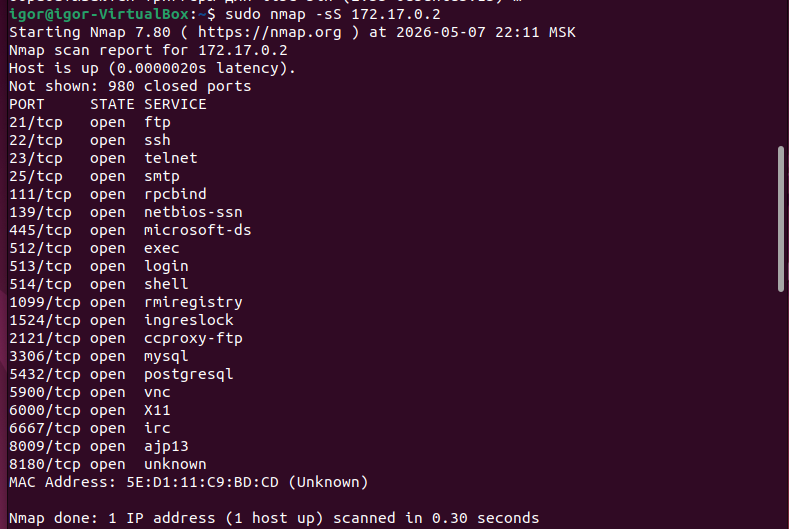
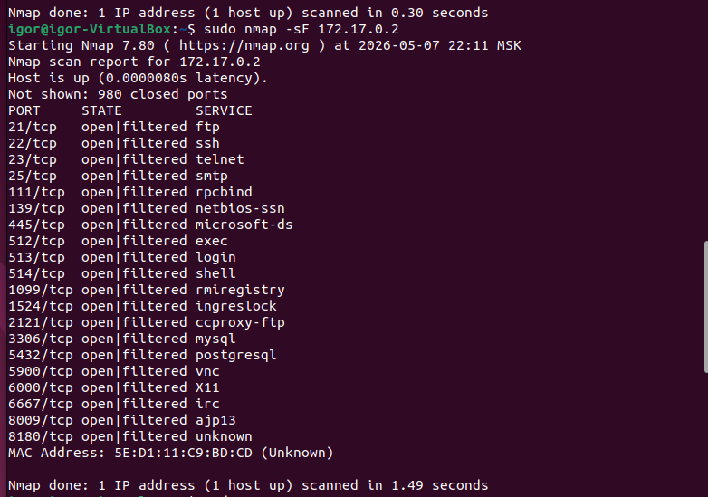
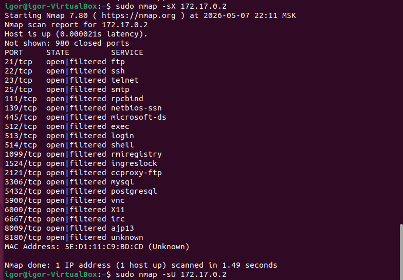
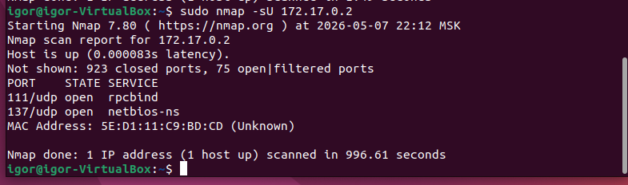

# Домашнее задание к занятию «Уязвимости и атаки на информационные системы»
Выполнил: Береснев Игорь Андреевич

---

## Задание 1. 

Скачайте и установите виртуальную машину Metasploitable: https://sourceforge.net/projects/metasploitable/.

Это типовая ОС для экспериментов в области информационной безопасности, с которой следует начать при анализе уязвимостей.

Просканируйте эту виртуальную машину, используя nmap.

Попробуйте найти уязвимости, которым подвержена эта виртуальная машина.

Сами уязвимости можно поискать на сайте https://www.exploit-db.com/.

Для этого нужно в поиске ввести название сетевой службы, обнаруженной на атакуемой машине, и выбрать подходящие по версии уязвимости.

Ответьте на следующие вопросы:

Какие сетевые службы в ней разрешены?
Какие уязвимости были вами обнаружены? (список со ссылками: достаточно трёх уязвимостей)

Приведите ответ в свободной форме.

### Скриншот сканирования Metasploitable

Сетевые службы: FTP (vsftpd 2.3.4), SSH, Telnet, Samba, MySQL, distccd, PostgreSQL, VNC, UnrealIRCd, Apache Tomcat.

Уязвимости:

vsftpd 2.3.4 - бэкдор (https://www.exploit-db.com/exploits/17491)

UnrealIRCd 3.2.8.1 - бэкдор (https://www.exploit-db.com/exploits/13853)

Samba 3.x - command injection (https://www.exploit-db.com/exploits/16320)

## Задание 2

Проведите сканирование Metasploitable в режимах SYN, FIN, Xmas, UDP.

Запишите сеансы сканирования в Wireshark.

Ответьте на следующие вопросы:

Чем отличаются эти режимы сканирования с точки зрения сетевого трафика?
Как отвечает сервер?

Приведите ответ в свободной форме.

### Скриншот сканирования в режиме SYN

### Скриншот сканирования в режиме FIN

### Скриншот сканирования в режиме Xmas

### Скриншот сканирования в режиме UDP

Чем отличаются режимы сканирования с точки зрения сетевого трафика?

- SYN - отправляется TCP-пакет только с флагом SYN (как при начале соединения)

- FIN - отправляется TCP-пакет только с флагом FIN (как при завершении соединения)

- XMAS - отправляется TCP-пакет с флагами FIN, PSH и URG одновременно («новогодняя ёлка»)

- UDP - отправляется UDP-пакет (без установки соединения)

Как отвечает сервер?

 - SYN: открытый порт отвечает SYN+ACK, закрытый - RST

 - FIN: открытый порт не отвечает (игнорирует), закрытый - RST

 - XMAS: открытый порт не отвечает (игнорирует), закрытый - RST

 - UDP: закрытый порт отвечает ICMP-сообщением «Port Unreachable»

